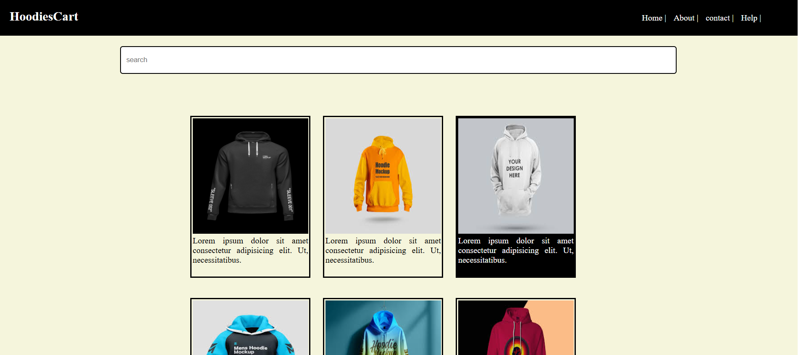

# HoodiesCart - HTML & CSS Webpage

A simple **responsive hoodie store webpage** built using only **HTML and CSS**. This project demonstrates a clean layout with a navbar, product section (cart layout), and footer. Perfect for beginners learning web design and responsive layouts.

## Features

- Fully responsive design for **desktop, tablet, and mobile**
- Navbar with navigation links
- Hoodie product section with a cart-style layout
- Footer with contact/info links
- Pure HTML and CSS – **no JavaScript required**
- Easy to customize and extend

## Demo

Here are the screenshots of my project:

  

## Installation

1. Clone the repository:

```bash
git clone https://github.com/SujiPrasanth/HoodiesCart-HTML-CSS-Webpage/tree/main

HoodiesCart-HTML-CSS-Webpage/
│
├── index.html        # Main HTML file
├── style.css         # CSS styles
├── images/           # Folder for hoodie images and screenshots
└── README.md         # Project documentation
